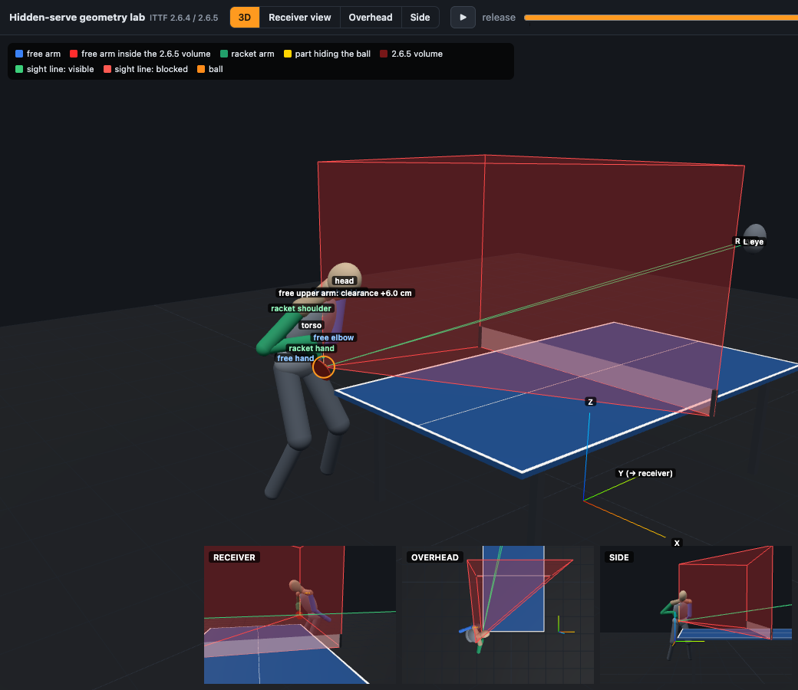
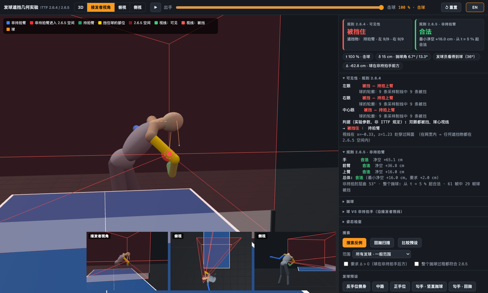
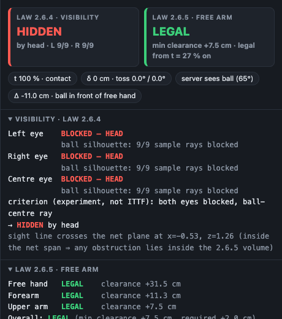
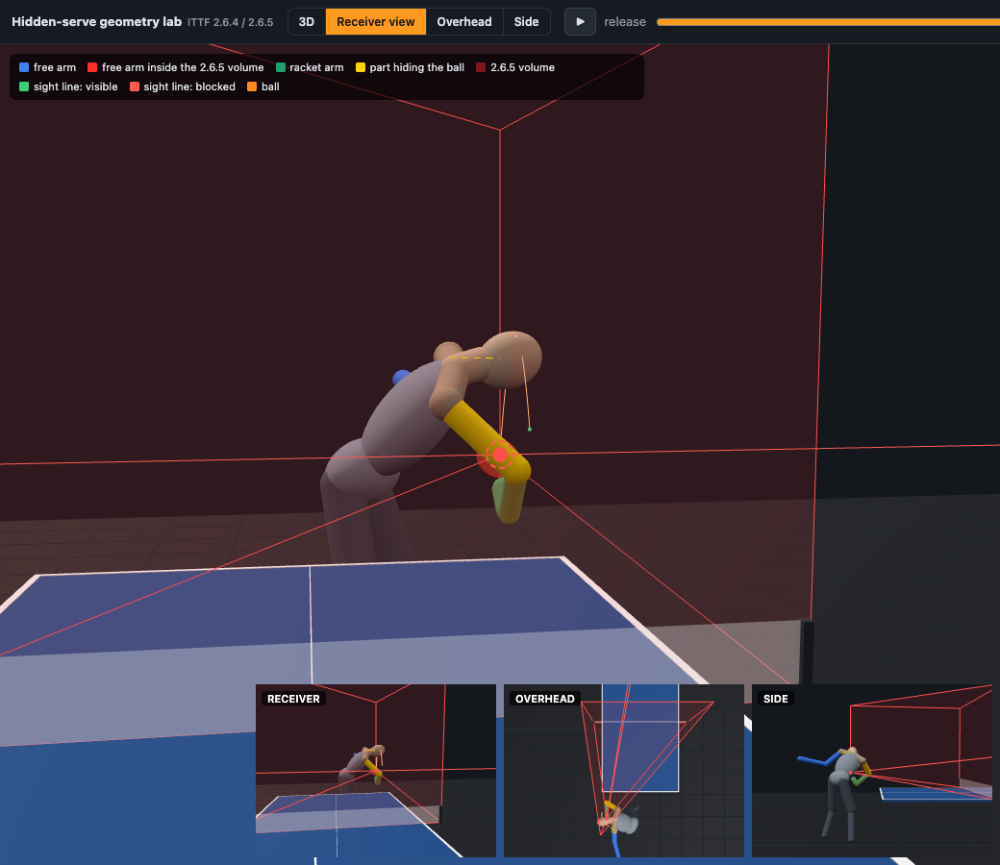
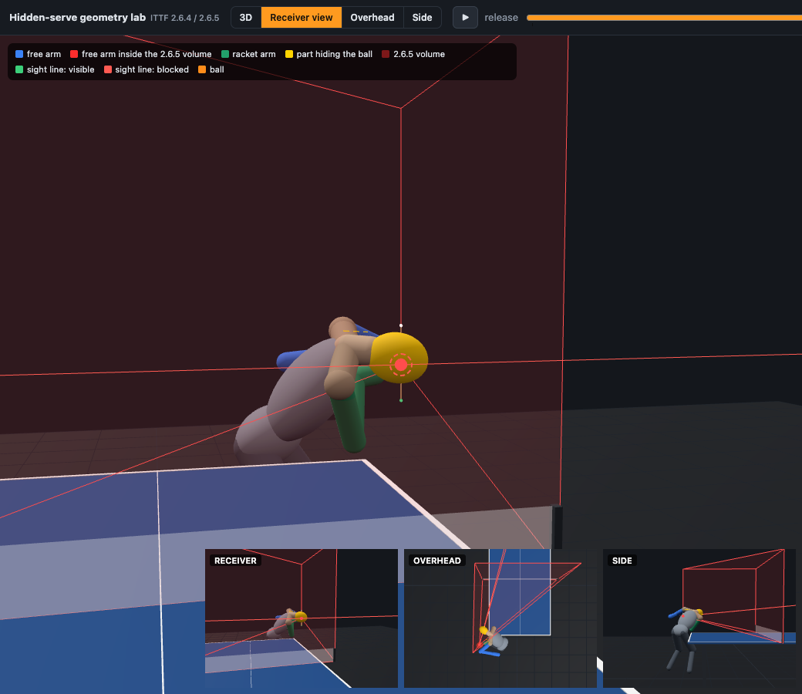
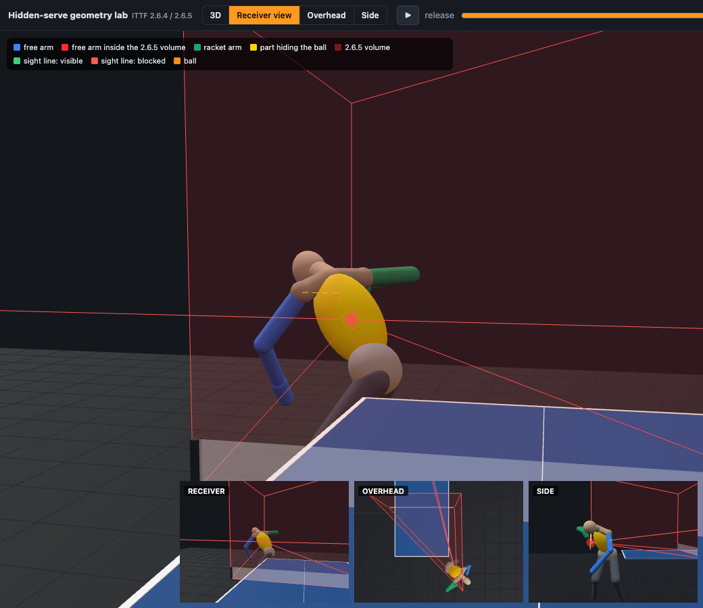
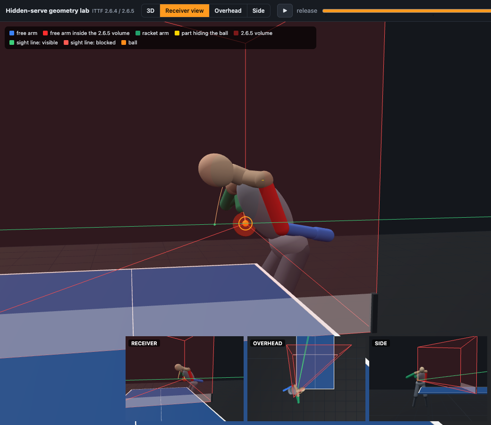
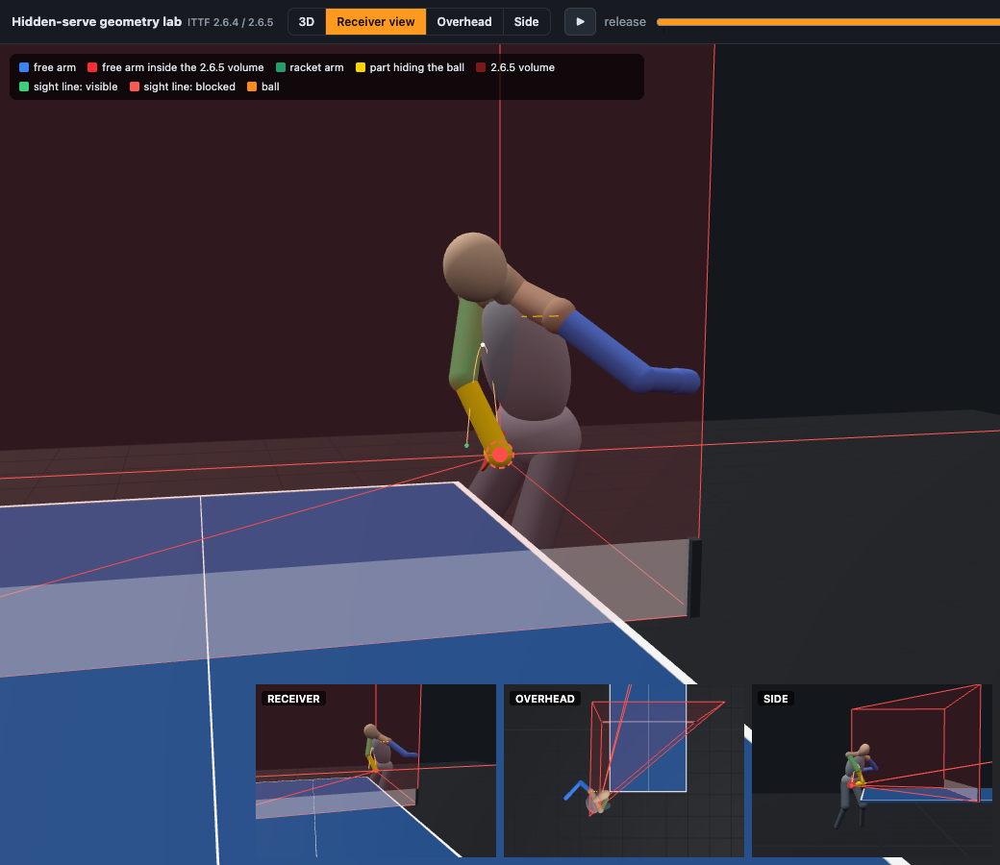
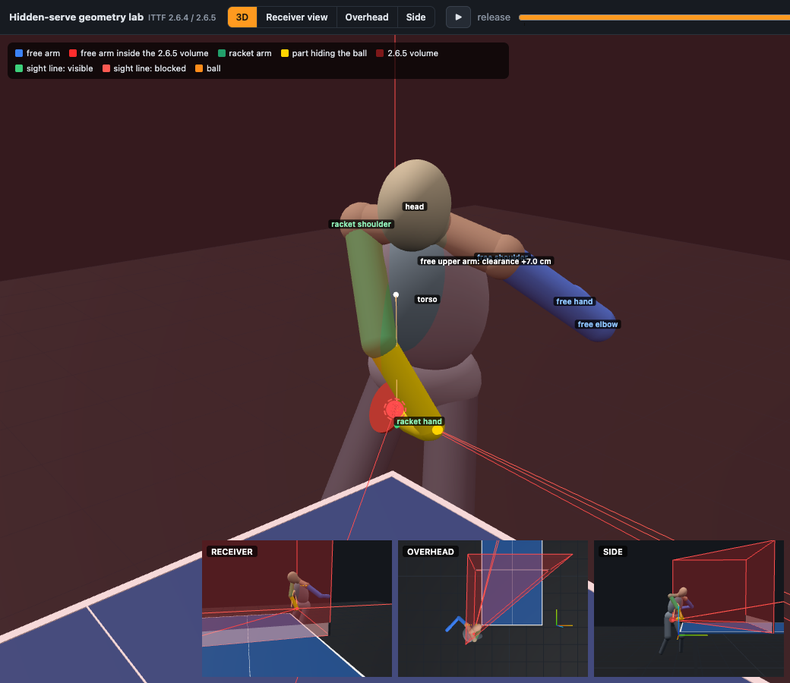
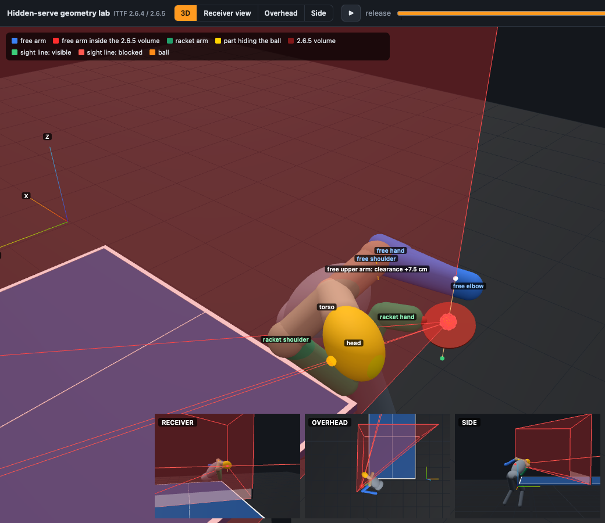

# Hidden-serve geometry lab (ITTF Laws 2.6.4 / 2.6.5)

一个纯前端、可交互的 3D 计算几何实验工具：研究 **free arm 已经满足 2.6.5（完全退出 “space between the ball and the net”）时，发球员还能否用头、肩、躯干等身体部位造成 2.6.4 所禁止的遮挡**，以及 **回抛（backward toss）** 对这种可能性的影响。

所有判定都来自解析几何（半空间、射线/胶囊体/椭球体求交、到凸多面体的精确有符号距离），没有任何 AI / CV 判定；每个 “遮挡/合法” 结论都能还原成一条明确的几何关系。

```bash
npm install
npm run dev          # http://localhost:5173
npm run check        # 几何核心自检（与暴力采样交叉验证）
npm run experiments  # 无头复现全部实验 → results/summary.md, results/experiments.json
```

技术栈：TypeScript · Three.js · Vite · OrbitControls · lil-gui。计算核心 `src/geom.ts`、`src/body.ts`、`src/serve.ts`、`src/search.ts` 不依赖 Three.js，浏览器（Web Worker）与 Node 跑的是同一份代码，结果逐位一致（搜索均为固定种子）。

---

## 1. 规则原文与来源

以 **ITTF Statutes 2026（第 54 版，2026-01-01 生效）** 为准 —— <https://documents.ittf.sport/sites/default/files/public/2026-02/2026_Statutes_v1_consolidated_clean.pdf>（第 39–42 页）。2.6.4 / 2.6.5 措辞与题述一致，无变化：

> **2.6.4** From the start of service until it is struck, the ball shall be above the level of the playing surface and behind the server's end line, and it shall not be hidden from the receiver by the server or his or her doubles partner or by anything they wear or carry.
>
> **2.6.5** As soon as the ball has been projected, the server's free arm and hand shall be removed from the space between the ball and the net. The space between the ball and the net is defined by the ball, the net and its indefinite upward extension.

本工具用到的其他条文（同一文件）：

| 条文 | 内容（原文摘录） | 在模型中的作用 |
|---|---|---|
| 2.1.1 | playing surface … 2.74m long and 1.525m wide … 76cm above the floor | 球台 |
| 2.2.2 | net … attached at each end to an upright post 15.25cm high, the outside limits of the post being 15.25cm outside the side line | 网的横向范围 ±0.915 m |
| 2.2.3 / 2.2.4 | top of the net … 15.25cm above the playing surface; bottom … as close as possible to the playing surface and the ends of the net shall be attached to the supporting posts from top to bottom | 网 = 台面到 0.9125 m 的竖直带，两端到网柱 |
| 2.3.1 | ball … diameter of 40mm | 球半径 2 cm |
| 2.5.6 | the free arm is the arm of the free hand | free arm = 上臂 + 前臂 + 手 |
| 2.5.14 | end line … extending indefinitely in both directions | 端线判定 |
| 2.6.1–2.6.3 | open palm, stationary; project the ball **near vertically upwards** … rises at least 16cm; strike as the ball is falling | 抛球物理与约束 |

规则之外的**官方解释/操作性定义**（只作为独立参考，不写进规则判定）：

* ITTF *Handbook for Match Officials*（16th ed., 2019）§10.3.1：“near vertically” means *“within a few degrees of the vertical, rather than within the angle of 45° that was formerly specified”*；§10.5.1：umpire 应确认球 *“not hidden from the receiver at any stage by any part of the body”*，且 free arm（含 free hand）不在该空间内；附录手势 “Hidden by what or whom (**elbow, shoulder, head** or partner)”。<https://www.tabletennisengland.co.uk/content/uploads/2021/10/HMO-16th-Edition.pdf>
* ITTF 新闻（2025-04-13）“Enhanced Table Tennis Review System … Macao 2025”：TTR 可复核项目包括 *“service toss angle (maximum 30 degrees)”* 与 *“ball visibility during service (ball hiding)”*。<https://www.ittf.com/2025/04/13/enhanced-table-tennis-review-system-to-feature-at-ittf-mens-and-womens-world-cup-macao-2025/>（该页有 Cloudflare 拦截，文字经 ittf.com 站内搜索索引核对。）**30° 是 TTR 的操作阈值，不是 Laws 的文字**；工具里它只以 overlay（“Show TTR 30° cone” + 状态栏提示）出现，且 TTR 如何测 “angle”（初速度方向？release→apex 连线？）未公开，所以两种都显示。

**ITTF 没有规定**：单眼可见算不算 “not hidden”、遮住球的一部分算不算 hidden。工具中的 `both eyes / either eye / centre-eye`、`ball-centre ray / whole ball` 全部是**实验参数**，不是 ITTF 标准。

---

## 2. 坐标系与几何常数

* X = 横向（发球员的右手方向为 +X），Y = 发球员 → 接发球员，Z = 竖直向上（地面 Z=0，台面 Z=0.76）。
* 球网在 Y=0；发球员端线 Y=−1.37，接发球员端线 Y=+1.37。网顶 Z=0.9125；网柱外缘 |X|=0.915。
* 所有长度为米（m），角度为度（°）。

---

## 3. 2.6.5 空间的数学定义（核心）

### 3.1 定义

设某时刻球心为 **B**（B_y < 0），网及其无限向上延伸为

  N = { (x, 0, z) : |x| ≤ w, z ≥ z₀ }，w = 网的半宽，z₀ = 0.76（2.2.4：网底尽量贴近台面）。

“defined by the ball, the net and its indefinite upward extension” 最字面的数学读法是**由球与 N 张成的凸包**：

  **V(B) = conv({B} ∪ N)** —— 所有 “球上一点与（延伸后的）网上一点之间的线段” 扫过的区域。

### 3.2 定理：V 恰好是 4 个半空间的交

对 V 中一点 p，令 s = p_y / B_y ∈ [0,1]（s=1 在球处，s=0 在网面）。p ∈ V ⇔ p = sB + (1−s)q 且 q ∈ N ⇔

* |p_x − s·B_x| ≤ (1−s)·w  —— 两个**竖直**平面：过 B 与竖直线 {x=±w, y=0}；
* p_z ≥ s·B_z + (1−s)·z₀  —— **底面**：过 B 与直线 {y=0, z=z₀} 的斜平面；
* p_y ≤ 0  —— 网面。

所以 V = {y ≤ 0} ∩ H_left ∩ H_right ∩ H_floor（闭包；s=1 时退化为球心正上方的竖直射线）。代码：`makeVolume()`，`src/geom.ts`。

几何含义：
* **俯视**是球与两个网端点构成的三角形 wedge；
* **三维**是这个 wedge 向上无限拉伸的“楔形柱”，但**底面是从球心斜降到网脚的平面**，不是水平面；
* 越靠近球，wedge 越窄（在球前方 d 处半宽约 ≈ d·(w ± B_x)/|B_y|，球在中路、|B_y|≈1.5 时约 0.6·d），底面越接近球的高度；
* **球的横向位置**：球偏到一侧时 wedge 明显不对称（靠近一侧的边几乎与 Y 轴平行）；工具中拖动 Release lateral / Server X 即可实时看到。

### 3.3 可切换的解释（GUI → RULE MODEL）

| 选项 | 默认 | 说明 |
|---|---|---|
| 网的横向范围 w | **±0.915 m（含网柱外缘）** | 2.2.4 说网两端“从上到下固定在网柱上”，所以网延伸到网柱；另提供 ±0.895（网柱内侧，排除约 2 cm 网柱本身）、±0.7625（只到边线，**规则不支持**，仅作对比）。0.915 与 0.895 只差 2 cm，网柱是否计入几乎不影响结果。 |
| 下边界 | **convex hull（底面过网脚，字面解释）** | 另有 *hull from net top*（底面过网顶，宽松）、*vertical prism*（wedge 内台面以上全部，严格）。后者 ⊃ 默认 ⊃ 前者。 |
| 要求的净空 margin | **2 cm** | 真实球是 40 mm 球体：conv(球体 ∪ N) ⊂ V(B) ⊕ 半径 2 cm 球，所以“离 V(B) ≥ 2 cm” 保证不进入以整个球体定义的空间（保守）。 |

### 3.4 算法（全部精确，`src/geom.ts`）

* **point-in-volume**：4 个点积，max_i(n_i·p − d_i) ≤ 0。
* **segment ∩ V**：对 4 个半空间做 Liang–Barsky 裁剪（精确布尔）。
* **到 V 的有符号距离**：内部 = max_i(n_i·p − d_i)（到最近面的距离）；外部 = 在 4 个面、6 条棱线、≤4 个顶点上的投影中取“可行且最近”的那个 —— 这是到凸多面体的精确欧氏投影。
* **capsule（胶囊体）与 V 的间隙**：对凸集的有符号距离沿直线是凸函数，所以沿胶囊轴线做黄金分割搜索得到全局最小值，再减半径 —— `clearance = min_t sd(a + t(b−a)) − r − margin`。
* `npm run check` 用随机测试验证：投影距离不被任何 V 内随机点击败、线段距离与 2000 点暴力采样一致、裁剪布尔与距离符号一致、遮挡判定与密集采样一致。

### 3.5 一个规则层面的几何引理（与人体模型无关）

> **视线引理**：设接发者眼睛 E 在网的另一侧，E→B 的视线与网面 Y=0 交于 P。若 P ∈ N（|P_x| ≤ w 且 P_z ≥ 台面），则线段 [P, B] 整段位于 V 内（V 是凸集，P、B 都在 V 中）。

推论（只依赖规则定义和“发球员身体在己方半区”）：

1. **在发球员一侧挡住视线的任何东西，都必然位于 2.6.5 空间内。** 所以严格遵守 2.6.5 的 free arm **在几何上不可能成为遮挡物**。唯一例外是 P 落在网宽之外：P_x ≈ 0.56·B_x + 0.44·E_x（典型距离），接发者在中间时球要在 |B_x| > ~1.6 m（边线外 ~0.85 m）才会发生 —— 不属于常见站位。状态栏实时显示 P 是否在网宽内。
2. 2.6.5 只约束 free arm，不约束头、躯干、持拍臂。因此问题被精确地归结为：**头/肩/躯干能否进入 V 内的视线，同时 free arm（其根部是 free shoulder 关节）整条留在 V 外？** 这正是本工具搜索的问题。
3. free shoulder 本身就是 free arm 的根部：free-side 肩（三角肌/斜方肌）要挡住视线，它必须在 V 内或贴着 V，而上臂胶囊从同一个关节中心出发 —— 这一项因此几乎被 2.6.5 “连带禁止”（实验见 §10：typical 范围内最好也只有约 1 cm 余量，common 范围内未找到）。

---

## 4. 可见性测试（`evaluate()`，`src/serve.ts`）

* 接收者：左右眼 + 中心眼（默认 x=0，眼睛在己方端线后 0.55 m，眼高 1.45 m —— 成年男性屈膝准备姿势；瞳距 63 mm；全部可调）。接收者面向 −Y，所以**左眼在 +X**。
* 每只眼向球心发一条线段；与每个身体部件做精确求交：胶囊体（线段-线段最近距离 < r）、椭球体（变换到单位球后求最近距离）、球拍（薄椭圆板，线-平面交点在椭圆内）、球网（视线在网顶以下穿过网面）。
* 每个部件给出一个连续的“遮挡深度” m（>0 ⇔ 遮挡，符号精确；胶囊体为精确米制深度，椭球体为保守下界），用于搜索的连续目标函数。
* “whole ball” 模式在球的轮廓上再取 8 条射线，要求 9 条全部被同一类部件挡住。
* 状态栏同时给出每只眼被挡的部件（最靠近眼睛的排第一）、9 条轮廓射线中被挡的数量、视线与网面的交点。
* 判据 `both eyes / either eye / centre-eye` 只是实验参数。

**Δ（ball vs free hand）**：u = 中心眼→球的单位向量（接收者真实视线方向，而不是屏幕左右）。Δ = (B − E)·u − (H − E)·u，H 为 free hand 中心。**Δ > 0 ⇒ 球比 free hand 离接收者更远 = BALL BEHIND FREE HAND**。

---

## 5. 人体模型（`src/body.ts`，右手持拍，约 1.78 m 成年男性，尺寸集中在 `DIM`）

| 部件 | 形状 | 尺寸 |
|---|---|---|
| head | 椭球 | 半轴 0.078 × 0.098 × 0.115 m |
| neck | 胶囊 | r 0.055 |
| torso（胸腹） | 椭球 | 半轴 0.165 × 0.115 × 0.25，随 thorax 扭转 |
| pelvis（计入 torso 类） | 椭球 | 0.17 × 0.11 × 0.13 |
| shoulders | 关节点 ±0.185 m；三角肌球 r 0.055；斜方肌胶囊（颈根→肩）r 0.05 | 分 free-side / racket-side |
| upper arm / forearm | 胶囊 | 0.31 m r 0.045 / 0.26 m r 0.037 |
| hands | 胶囊（≈ 0.2 m 长、r 0.042 的“手掌椭球”包络，用胶囊以便精确算到 V 的距离） | |
| racket | 柄：胶囊；拍面：0.158 × 0.150 m 薄椭圆板 | |
| legs | 胶囊（仅作遮挡物与背景） | |

* 姿态参数：髋中点位置与高度（屈膝程度）、torso yaw（0 = 胸口朝向接收者，−90° = 胸口朝 +X、左肩对网）、前倾 lean、侧倾、肩线相对骨盆的扭转（shoulder rotation）、颈部前屈（head lean）与侧屈（head lateral）。
* free arm：给定 free wrist 相对 free shoulder 的目标（thorax 坐标）+ 肘部 swivel，解析两骨 IK；骨长严格不变（自检验证）。
* racket arm：拍面法向（拍→球）+ 拍柄滚转决定球拍，球恰好贴拍面中心；IK 到手腕。约束：够得着、腕部弯折 ≤ 100°、拍面推球方向朝接收者（n_y ≥ 0.2）。
* 自碰撞：手肘、手腕、手、拍面中心与拍面边缘 8 点不能进入头/躯干/骨盆/大腿；球不能与任何身体部件相交。
* 球台是实心的：任何身体部件（椭球、胶囊）都不能进入台面（3 cm 厚的板）；站位靠近端线时，这一条决定髋能离端线多近。
* **发球员必须能看着球击球**：从两眼之间（头部前方）到球的连线，与面部朝向的夹角 ≤ 65°，且不能被自己的躯干、骨盆、肩、上臂、free 前臂/手、腿、颈挡住（持拍手、持拍前臂和球拍除外）。没有这一条时，搜索会给出“球藏在自己肩后/胸下、发球员自己也看不到”的解 —— 几何上成立，但人不会这样发球。
* **简化（已知局限）**：刚体椭球/胶囊、无头部转动（只有前屈与侧屈）、无肩胛前伸、无衣服/头发、单一体型；球拍接触点固定在拍面中心；时间轴的身体运动是简单插值，不是生物力学模型。

---

## 6. 发球 presets（击球瞬间姿态，`PRESETS`，`src/serve.ts`）

| preset | 髋中点 (x, y, h) | yaw | lean | 扭转 | 颈前屈 | 抛球点（髋前方, 横向, 高度） | 回抛 δ | 击球点 (x, y, z)，端线后距离 |
|---|---|---|---|---|---|---|---|---|
| A Backhand corner / side-on（pendulum / reverse pendulum 站位；**默认**） | (−1.07, −1.44, 0.86) | −80° | 28° | 10° | 25° | (0.30, 0.05, 0.98) | 0 | (−0.77, −1.44, 0.92)，7 cm |
| B Middle | (−0.25, −1.60, 0.86) | −45° | 25° | 5° | 20° | (0.30, 0.05, 0.98) | 0 | (0.00, −1.42, 0.92)，5 cm |
| C Forehand side | (0.30, −1.64, 0.86) | −65° | 25° | 10° | 25° | (0.45, 0.00, 0.98) | 0 | (0.71, −1.45, 0.92)，8 cm |
| D Hook — vertical toss | (−1.00, −1.40, 0.84) | −85° | 35° | 15° | 35° | (0.48, 0.10, 1.00) | **0** | (−0.51, −1.46, 1.00)，9 cm |
| E Hook — backward toss | 与 D 完全相同 | | | | | 同一抛球点 | **0.20 m（可调）** | (−0.71, −1.48, 1.00)，11 cm |

所有 presets 都按比赛站位设置：击球点在端线后 5–11 cm。Preset A 是打开页面时的默认姿态（顶栏 **↺ 重置** 回到它）：髋中点在端线后 7 cm、左边线外 31 cm，球在髋前 0.30 m 出手，正好在反手位台角后方。面向球台的站位（B、C）髋离端线 0.23–0.27 m（再往前约 5 cm 大腿就会碰到台面）；侧身站在台外的站位（A、D、E）髋可以几乎贴着端线。

D 与 E 只差回抛：同一站位、同一身体、同一接收者、同一抛球点，唯一变化是球在下落时向身体方向漂移 δ。

---

## 7. 回抛（backward toss）的定义

* 抛球点 R：在 yaw 坐标系中，位于髋中点前方 `relFwd`、横向 `relLat`、高度 `relZ`。
* 漂移方向 u：水平面内，**指向身体（−facing）**，可用 `tossAz` 偏转（+ = 偏向发球员右侧）。
* 击球点 C = R + δ·u（水平），高度 `contactZ`。
* 物理：竖直初速 v_z = √(2g·rise)，飞行时间 T = 上升 + 下落到击球高度，水平速度 v_h = δ/T，轨迹为抛物线。
* 显示两种“toss angle”：**launch angle** = atan(v_h/v_z)（初速度与竖直的夹角）和 **chord angle** = release→apex 连线与竖直的夹角（= atan(2·tan launch)）。规则只说 “near vertically”；30° 仅为 TTR 操作阈值（见 §1）。
* 例：rise 30 cm、在原高度击球时，δ = 20 cm ⇒ launch 9.5°、chord 18.4°；δ = 40 cm ⇒ launch 18.4°、chord 33.7°。

时间轴（release → rising → apex → falling → contact）：每帧重算球位置、V、free arm 净空与可见性。身体从“预备姿态”（肩线反转 −20°、头抬起）平滑过渡到击球姿态；free wrist 在前 30 % 飞行时间内从托球位置撤到目标位置；球拍从拍面后方 30 cm 挥入。状态栏给出 “free arm 从 t = x % 起永久离开 V” 与 “整个抛球过程中有多少帧球被遮挡”。

---

## 8. 反例搜索

**问题**：在现实范围内找姿态，使 ① 击球瞬间 free arm 三段（上臂、前臂、手）到 V 的净空都 ≥ margin；② 目标部件按当前判据挡住球；③ 姿态满足全部现实约束。

**目标函数**：maximize J = min(目标部件遮挡深度, free arm 最小净空) − 10 × 约束违反量。J > 0 且无违反 ⇔ 找到反例；J 的数值就是反例的“稳健裕度”（两个条件都至少满足这么多厘米）。

**算法**：3000 个均匀随机样本 → 取最好 16 个做 (1+1)-ES 爬山（各 500 步，自适应步长）→ 若未找到，再换 3 个种子、用更大预算（6000 个样本、30 个起点 × 800 步）重跑。实验脚本还做 **cross-seeding**：每次搜索都从全研究中已找到的同目标姿态出发，并先跑一遍安静的预热，所以宽松变体不会漏掉严格变体已经找到的解。“none” 只表示 **No counterexample was found within the modeled parameter range**，不是数学上的不可能。

**参数范围**（`TYPICAL` 为主实验，`EXTENDED` 只做敏感性）：

| 参数 | typical | extended |
|---|---|---|
| 髋中点 x / y / 高度 | −1.1…0.9 / −2.0…−1.40 / 0.80…0.92 | 高度 0.78…0.95 |
| torso yaw | −105°…60° | −110°…70° |
| 前倾 / 侧倾 / 肩扭转 | 5…45° / ±10° / ±30° | 0…50° / ±20° / ±35° |
| 颈前屈 / 颈侧屈 | 0…45° / ±20° | −10…55° / ±35° |
| free wrist（相对 free shoulder，thorax 坐标：右/前/上） | −0.55…0.30 / −0.40…0.45 / −0.60…0，且世界坐标下手腕不高于肩 | 上 ≤ +0.25，无世界坐标约束 |
| 抛球点（髋前方 / 横向 / 高度） | 0.25…0.65 / ±0.35 / 0.85…1.15 | 0.25…0.70 / ±0.40 / 0.82…1.25 |
| 回抛 δ / 方向 | 0…0.30 m / ±30° | 0…0.40 m / ±45° |
| 击球高度 | 0.80…1.10 m | 0.80…1.40 m |
| 球拍方向、两肘 swivel | 全范围（受上述约束） | 同 |

**击球区与 free arm 姿态（typical / common，extended 不加）**：球必须在髋中点前方 0.15–0.70 m（身体朝向方向）、横向 −0.45…+0.55 m、|x| ≤ 0.95（台宽延长线外 ≤ 19 cm）、端线后 ≤ 0.63 m；free wrist 不高于 free shoulder（世界坐标，抛球后 free arm 落下）。没有这些约束时，搜索会找到“在髋侧/身后、台外 0.5 m 击球”或“free arm 高举过头”的解（几何上成立，但不是常见发球）。

**三个范围（envelope）**：`TYPICAL`（主实验）；`COMMON` = typical 再收紧到 **击球高度 ≤ 1.00 m、躯干前倾 ≤ 35°、颈前屈 ≤ 35°**（常见的低发球姿态）；`EXTENDED`（关节极限附近、无击球区约束，只做敏感性）。

---

## 9. 界面使用

* 顶栏：`3D / RECEIVER VIEW / OVERHEAD / SIDE` 相机预设；时间轴滑块（release → contact）与 ▶ 播放。右下角三个小窗始终显示 receiver / overhead / side 视图。
* RECEIVER VIEW：相机放在接收者中心眼，看向球；滚轮调 FOV。球为高亮橙色 + 圆环；被挡时圆环变红色虚线，`Show hidden ball` 打开后以红色线框穿透显示球的真实位置。
* 颜色：free arm 蓝色（进入 2.6.5 空间的段变红）；持拍臂绿色；**正在遮挡视线的部件黄色**；2.6.5 空间半透明红色；黄色虚线 = free arm 到空间的最小净空；视线绿色（可见）/红色（被挡）。
* 右上角 **↺ 重置** 按钮回到默认姿态（Preset A：反手位比赛站位，髋在端线后 7 cm、左边线外 31 cm，球在反手位台角后方）；**中文 / EN** 按钮切换整个界面的语言（状态、表格、控件、3D 标签都会切换；选择保存在本机浏览器）。
* 右侧：两张结论卡（规则 2.6.4 可见性 / 规则 2.6.5 非持拍臂）+ 一行要点（时间、回抛与抛球角、发球员能否看到球、Δ、姿态问题）→ 可折叠的详细分节 → 搜索（搜索反例 / 回抛扫描 / 比较预设；范围 typical / common / extended / 当前预设附近；可勾选 “Δ > 0” 与 “整个抛球过程都符合 2.6.5”）→ 发球预设 → 姿态 JSON（“复制” 到剪贴板；“载入 / 编辑” 打开对话框，可粘贴别处的姿态或直接改参数，⌘/Ctrl + Enter 载入）→ 全部参数控件。
* 3D 视图左上角是颜色图例。
* 结果表格每个格子可点击，直接载入该姿态（并高亮遮挡部件）。

<p> </p>
<p></p>

文件：`src/geom.ts`（几何核心）· `src/body.ts`（人体）· `src/serve.ts`（presets、抛球、逐帧判定）· `src/search.ts`（反例搜索/扫描/比较）· `src/worker.ts` · `src/main.ts`（界面）· `src/i18n.ts`（中英文）· `scripts/check.ts` · `scripts/experiments.ts` · `results/` · `docs/`。

---

## 10. 实验结果（`npm run experiments` 实测输出；完整表格与姿态 JSON 见 `results/summary.md` / `results/experiments.json`）

**读表方法**：默认设置 = 双眼都被挡才算 hidden、看球心视线、hull 下边界、网宽 ±0.915 m、free arm 必须离空间 ≥ 2 cm、接收者在中线（x=0，眼高 1.45 m，端线后 0.55 m），并且**发球员必须能看着球**（§5）。格子里的数值 = **min(目标部位的遮挡深度, free arm 净空)**（cm）：正数 = 反例成立，两个条件都至少有这么多余量；负数 = 搜索到的最好姿态离反例还差多少（或违反现实约束多少）。**FOUND** ≥ 1 cm；marginal = 0–1 cm（在建模精度以内，不当作有意义的反例）；none = *No counterexample was found within the modeled parameter range.*（不是数学上的不可能）。

> 关于“发球员必须能看着球”：早先没有这条约束时，搜索会把球藏到发球员自己的肩后或胸下 —— 几何上成立，但连发球员自己也看不到球。加上这条后，肩部遮挡几乎消失，躯干遮挡只剩“背对接发球员”一种做法，结论因此和早先版本不同（下面全部是加约束后的结果）。

### 10.1 Presets 原样（未经搜索）

**1. Presets (nominal poses, default settings)**

| preset | ball at contact (m) | toss δ / launch | 2.6.5 free arm (min clearance) | free arm out of volume from | ball hidden at contact | ball hidden during toss | Δ ball−free hand |
|---|---|---|---|---|---|---|---|
| Backhand corner / side-on | (-0.77, -1.44, 0.92) | 0 cm / 0.0° | LEGAL (+6.0 cm) | t = 20 % | no | 0/61 frames | -1.8 cm |
| Middle | (-0.00, -1.42, 0.92) | 0 cm / 0.0° | LEGAL (+10.2 cm) | t = 2 % | no | 0/61 frames | -19.0 cm |
| Forehand side | (0.71, -1.45, 0.92) | 0 cm / 0.0° | LEGAL (+12.5 cm) | t = 18 % | no | 0/61 frames | -1.8 cm |
| Hook — vertical toss | (-0.51, -1.46, 1.00) | 0 cm / 0.0° | LEGAL (+12.8 cm) | t = 2 % | no | 0/61 frames | -3.4 cm |
| Hook — backward toss | (-0.71, -1.48, 1.00) | 20 cm / 9.5° | **ILLEGAL** (-3.2 cm) | never (in volume at contact) | no | 16/61 frames | -1.4 cm |

* A–D：球全程可见；free arm 在出手后 2 %（B、D）到 18–20 %（A、C）的飞行时间内离开空间。A、C 慢一些：free 上臂/前臂在撤回途中有几帧离空间边界不到 2 cm（进入余量带，最多 2.2 cm），之后才稳定离开。
* **E（回抛 20 cm，其他与 D 完全相同）free arm 违规 −3.2 cm**：侧身站位下球被回抛到胸前，free shoulder 落到球的前方（更靠近网）且在楔形里，上臂根部于是进入 2.6.5 空间；下落段 68–93 % 球先被 free-side 肩、再被躯干挡住 —— 此时 free arm 同样在空间内。同时发球员看球偏离面部 70°（超出 65°），需要转头。

### 10.2 反例搜索（Cases A–D，全部发球类型）

**2a. Counterexample search — all serve types, TYPICAL ranges**

| case | condition | result: min(obstruction depth, free-arm clearance) cm | obstruction / clearance cm | pose | evaluations |
|---|---|---|---|---|---|
| A | 2.6.5 compliant AND ball hidden by torso | **FOUND** +11.1 | +11.1 / +13.1 | yaw -98°, lean 33°, side 10°, twist -30°, neck flex 41°, neck lat 5°, contact (0.95, -1.92, 1.04) m, δ 10 cm | 11057 (1 seed) |
| B | 2.6.5 compliant AND ball hidden by shoulder | **FOUND** +1.9 | +1.9 / +3.9 | yaw 60°, lean 45°, side -2°, twist 30°, neck flex 44°, neck lat -7°, contact (-0.95, -1.60, 1.04) m, δ 7 cm | 11057 (1 seed) |
| B1 | … by the free-side shoulder | none (-1.7) | -1.7 / +0.3 | yaw -105°, lean 43°, side -7°, twist -30°, neck flex 37°, neck lat 6°, contact (0.95, -1.93, 1.10) m, δ 15 cm | 101076 (4 seeds) |
| B2 | … by the racket-side shoulder | marginal +0.2 | +0.2 / +5.3 | yaw 60°, lean 42°, side -7°, twist 30°, neck flex 34°, neck lat -11°, contact (-0.94, -1.94, 1.09) m, δ 7 cm | 11004 (1 seed) |
| C | 2.6.5 compliant AND ball hidden by head | **FOUND** +5.5 | +5.5 / +7.5 | yaw 60°, lean 45°, side 10°, twist 30°, neck flex 44°, neck lat 20°, contact (-0.95, -1.55, 1.10) m, δ 0 cm | 11060 (1 seed) |
| D | 2.6.5 compliant AND ball hidden by racket arm | **FOUND** +4.3 | +4.3 / +16.0 | yaw 60°, lean 45°, side 2°, twist 30°, neck flex 40°, neck lat -20°, contact (-0.65, -1.84, 1.02) m, δ 15 cm | 11025 (1 seed) |

**2b. Counterexample search — all serve types, COMMON envelope (contact ≤ 1.00 m, lean ≤ 35°, neck flexion ≤ 35°)**

| case | condition | result: min(obstruction depth, free-arm clearance) cm | obstruction / clearance cm | pose | evaluations |
|---|---|---|---|---|---|
| A | 2.6.5 compliant AND ball hidden by torso | **FOUND** +10.8 | +10.8 / +23.0 | yaw -105°, lean 35°, side 7°, twist -15°, neck flex 35°, neck lat -20°, contact (0.92, -1.88, 0.80) m, δ 23 cm | 11058 (1 seed) |
| B | 2.6.5 compliant AND ball hidden by shoulder | none (-3.6) | -3.6 / -1.6 | yaw 60°, lean 35°, side 10°, twist 30°, neck flex 32°, neck lat 1°, contact (-0.95, -1.52, 1.00) m, δ 10 cm | 101232 (4 seeds) |
| B1 | … by the free-side shoulder | none (-6.6) | -6.6 / -4.6 | yaw -101°, lean 35°, side -10°, twist -30°, neck flex 34°, neck lat 12°, contact (0.95, -1.76, 1.00) m, δ 18 cm | 101080 (4 seeds) |
| B2 | … by the racket-side shoulder | none (-3.7) | -3.7 / -1.7 | yaw 60°, lean 35°, side 10°, twist 30°, neck flex 29°, neck lat -19°, contact (-0.94, -1.57, 1.00) m, δ 11 cm | 101020 (4 seeds) |
| C | 2.6.5 compliant AND ball hidden by head | none (-8.4) | -8.4 / -6.4 | yaw -81°, lean 35°, side -10°, twist -14°, neck flex 35°, neck lat -20°, contact (-0.60, -1.79, 1.00) m, δ 30 cm | 101240 (4 seeds) |
| D | 2.6.5 compliant AND ball hidden by racket arm | **FOUND** +4.3 | +4.3 / +7.3 | yaw 60°, lean 35°, side 10°, twist 30°, neck flex 35°, neck lat -14°, contact (-0.90, -1.83, 0.98) m, δ 21 cm | 11026 (1 seed) |

**2c. Counterexample search — all serve types, EXTENDED ranges (no contact-zone constraint)**

| case | condition | result: min(obstruction depth, free-arm clearance) cm | obstruction / clearance cm | pose | evaluations |
|---|---|---|---|---|---|
| A | 2.6.5 compliant AND ball hidden by torso | **FOUND** +11.4 | +11.4 / +13.5 | yaw -101°, lean 33°, side 10°, twist -30°, neck flex 41°, neck lat 6°, contact (0.99, -1.93, 1.04) m, δ 10 cm | 11059 (1 seed) |
| B | 2.6.5 compliant AND ball hidden by shoulder | **FOUND** +5.3 | +5.3 / +7.6 | yaw 65°, lean 42°, side 3°, twist 35°, neck flex 52°, neck lat 7°, contact (-1.39, -1.55, 1.06) m, δ 8 cm | 11059 (1 seed) |
| B1 | … by the free-side shoulder | **FOUND** +3.6 | +3.6 / +5.7 | yaw -110°, lean 35°, side 15°, twist -35°, neck flex 1°, neck lat 29°, contact (0.88, -2.34, 1.29) m, δ 7 cm | 11021 (1 seed) |
| B2 | … by the racket-side shoulder | **FOUND** +5.3 | +5.3 / +10.5 | yaw 70°, lean 42°, side -11°, twist 35°, neck flex 31°, neck lat -18°, contact (-1.09, -1.99, 1.12) m, δ 7 cm | 11006 (1 seed) |
| C | 2.6.5 compliant AND ball hidden by head | **FOUND** +7.1 | +7.1 / +9.1 | yaw 65°, lean 45°, side 11°, twist 35°, neck flex 48°, neck lat 23°, contact (-0.77, -1.79, 1.10) m, δ 4 cm | 11060 (1 seed) |
| D | 2.6.5 compliant AND ball hidden by racket arm | **FOUND** +4.4 | +4.4 / +25.3 | yaw 69°, lean 16°, side -10°, twist 30°, neck flex 23°, neck lat 12°, contact (-1.24, -1.87, 1.25) m, δ 3 cm | 11027 (1 seed) |

**你的核心假设（A：击球瞬间 free arm 完全在空间外；B：球在 free hand 的接收者“后方”，Δ > 0）**：

**2d. Hypothesis A + B: free arm outside the volume AND ball behind the free hand (Δ > 0), typical ranges**

| case | result: min(obstruction, clearance, Δ) cm | obstruction / clearance / Δ cm | pose |
|---|---|---|---|
| A torso | **FOUND** +11.3 | +11.3 / +13.3 / +11.6 | yaw -105°, lean 37°, side 10°, twist -30°, neck flex 24°, neck lat 11°, contact (0.92, -1.97, 1.02) m, δ 0 cm |
| B shoulder | marginal +0.6 | +0.6 / +2.6 / +8.0 | yaw 60°, lean 33°, side 6°, twist 30°, neck flex 44°, neck lat 6°, contact (-0.94, -1.54, 1.10) m, δ 8 cm |
| B1 shoulderFree | none (-1.5) | -1.5 / +0.5 / +3.5 | yaw -105°, lean 45°, side -6°, twist -30°, neck flex 42°, neck lat 13°, contact (0.95, -1.97, 1.10) m, δ 15 cm |
| B2 shoulderRacket | **FOUND** +1.6 | +1.6 / +3.6 / +4.9 | yaw 60°, lean 42°, side -6°, twist 30°, neck flex 45°, neck lat -12°, contact (-0.95, -1.90, 1.09) m, δ 8 cm |
| C head | **FOUND** +5.3 | +5.3 / +7.3 / +10.7 | yaw 60°, lean 45°, side 10°, twist 30°, neck flex 45°, neck lat 18°, contact (-0.72, -1.79, 1.09) m, δ 8 cm |
| D racketArm | **FOUND** +4.3 | +4.3 / +6.4 / +5.0 | yaw 59°, lean 36°, side 5°, twist 2°, neck flex 19°, neck lat -16°, contact (-0.83, -1.92, 1.08) m, δ 15 cm |

找到的姿态都集中在两类站法上（看 yaw + 肩线扭转 = 肩线朝向）：

* **背对接发球员**（躯干 / 骨盆遮挡，Case A）：肩线转到 −120°～−135°，比侧身再多转 30°～45°，弯腰罩住胸前的球；接发球员从中路斜看过去，视线穿过发球员的背和躯干。发球员自己看得到胸前的球。
* **反手类站位，持拍侧肩对网**（头 / 持拍侧肩 / 持拍臂，Cases B、C、D）：肩线约 +85°～+90°。持拍上臂横在球前（D），或者深弯腰、低头，让头或持拍侧肩落到球的高度（B、C，需要击球点 ≥ 约 1.05 m）。

<p>  </p>

接收者视角（typical 范围的 Case D / C / A）：左 持拍上臂、中 头、右 躯干挡住球。红色虚线圈 = 被挡住的球的位置，黄色 = 正在遮挡的部件。

### 10.3 遮挡需要什么条件（typical 范围内逐项收紧）

**5. Highest allowed contact point (typical joints, contact zone on)**

| target | z ≤ 0.90 m | z ≤ 0.95 m | z ≤ 1.00 m | z ≤ 1.05 m | z ≤ 1.10 m | z ≤ 1.20 m |
|---|---|---|---|---|---|---|
| head | none (-4.1) | none (-1.3) | marginal +0.2 | **FOUND** +2.9 | **FOUND** +5.5 | **FOUND** +5.5 |
| shoulder | none (-3.9) | none (-0.6) | marginal +0.3 | **FOUND** +2.3 | **FOUND** +2.4 | **FOUND** +2.4 |
| shoulderFree | none (-8.2) | none (-5.5) | none (-3.7) | none (-2.8) | none (-1.0) | marginal +0.9 |
| torso | **FOUND** +10.8 | **FOUND** +10.8 | **FOUND** +10.8 | **FOUND** +11.4 | **FOUND** +11.4 | **FOUND** +11.4 |
| racketArm | **FOUND** +4.3 | **FOUND** +4.3 | **FOUND** +4.3 | **FOUND** +4.3 | **FOUND** +4.3 | **FOUND** +4.3 |

**5b. Highest allowed trunk lean (typical ranges otherwise)**

| target | lean ≤ 20° | lean ≤ 25° | lean ≤ 30° | lean ≤ 35° | lean ≤ 40° | lean ≤ 45° |
|---|---|---|---|---|---|---|
| head | none (-8.8) | none (-6.1) | none (-3.4) | none (-0.5) | **FOUND** +2.6 | **FOUND** +5.5 |
| shoulder | none (-2.3) | none (-0.4) | marginal +1.0 | **FOUND** +1.5 | **FOUND** +2.2 | **FOUND** +2.4 |
| torso | **FOUND** +10.8 | **FOUND** +10.8 | **FOUND** +11.3 | **FOUND** +11.4 | **FOUND** +11.4 | **FOUND** +11.4 |
| racketArm | **FOUND** +4.3 | **FOUND** +4.3 | **FOUND** +4.4 | **FOUND** +4.4 | **FOUND** +4.4 | **FOUND** +4.4 |

**5c. Highest allowed neck flexion — head target (typical ranges otherwise)**

| target | neck flex ≤ 15° | neck flex ≤ 25° | neck flex ≤ 35° | neck flex ≤ 45° |
|---|---|---|---|---|
| head | none (-0.0) | **FOUND** +1.9 | **FOUND** +4.0 | **FOUND** +5.5 |

### 10.4 回抛扫描

**6a. Backward-toss sweep — hook family, TYPICAL envelope**

| target | δ = 0 cm | δ = 5 cm | δ = 10 cm | δ = 15 cm | δ = 20 cm | δ = 30 cm | δ = 40 cm |
|---|---|---|---|---|---|---|---|
| head | **FOUND** +1.3 | marginal +0.4 | none (-0.1) | none (-0.6) | none (-1.2) | none (-2.4) | none (-3.4) |
| shoulder | none (-5.3) | none (-5.2) | none (-5.1) | none (-5.3) | none (-5.2) | none (-6.3) | none (-7.1) |
| torso | none (-2.0) | none (-2.0) | none (-0.6) | **FOUND** +1.3 | **FOUND** +3.5 | **FOUND** +3.5 | marginal +1.0 |
| toss angle (nominal hook toss, rise 30 cm): launch / chord | 0.0° / 0.0° | 2.4° / 4.8° | 4.8° / 9.5° | 7.1° / 14.0° | 9.5° / 18.4° | 14.0° / 26.6° | 18.4° / 33.7° |

**6b. Backward-toss sweep — hook family, COMMON envelope (contact ≤ 1.00 m, lean ≤ 35°, neck flexion ≤ 35°)**

| target | δ = 0 cm | δ = 5 cm | δ = 10 cm | δ = 15 cm | δ = 20 cm | δ = 30 cm | δ = 40 cm |
|---|---|---|---|---|---|---|---|
| head | none (-10.0) | none (-9.8) | none (-9.7) | none (-9.5) | none (-9.3) | none (-9.3) | none (-12.2) |
| shoulder | none (-9.1) | none (-9.1) | none (-9.0) | none (-9.0) | none (-9.1) | none (-9.1) | none (-9.8) |
| torso | none (-5.0) | none (-2.7) | none (-2.0) | none (-1.4) | marginal +0.2 | marginal +0.3 | marginal +0.5 |

**6c. Backward-toss sweep — all serve types, TYPICAL envelope, δ fixed**

| target | δ = 0 cm | δ = 10 cm | δ = 20 cm | δ = 30 cm |
|---|---|---|---|---|
| head | **FOUND** +5.5 | **FOUND** +5.1 | **FOUND** +3.7 | **FOUND** +2.3 |
| shoulder | **FOUND** +1.7 | **FOUND** +2.1 | **FOUND** +1.0 | marginal +0.6 |
| torso | **FOUND** +11.4 | **FOUND** +11.4 | **FOUND** +10.8 | **FOUND** +10.8 |

**6d. Backward-toss sweep — all serve types, COMMON envelope, δ fixed**

| target | δ = 0 cm | δ = 10 cm | δ = 20 cm | δ = 30 cm |
|---|---|---|---|---|
| head | none (-9.1) | none (-8.7) | none (-8.4) | none (-8.0) |
| shoulder | none (-3.6) | none (-3.6) | none (-3.7) | none (-3.7) |
| torso | **FOUND** +10.0 | **FOUND** +10.1 | **FOUND** +10.8 | **FOUND** +10.8 |

同一个 δ 对应的 “toss angle” 强烈依赖抛球高度（击球高度 = 出手高度时的 launch / chord 角）；**击球瞬间的几何只取决于 δ（球最后落在身体哪里），与角度本身无关**：

| 抛起高度 | δ=5 cm | 10 | 15 | 20 | 30 | 40 |
|---|---|---|---|---|---|---|
| 16 cm（规则下限） | 4.5° / 8.9° | 8.9° / 17.4° | 13.2° / 25.1° | 17.4° / **32.0°** | 25.1° / **43.2°** | **32.0°** / **51.3°** |
| 30 cm | 2.4° / 4.8° | 4.8° / 9.5° | 7.1° / 14.0° | 9.5° / 18.4° | 14.0° / 26.6° | 18.4° / **33.7°** |
| 50 cm | 1.4° / 2.9° | 2.9° / 5.7° | 4.3° / 8.5° | 5.7° / 11.3° | 8.5° / 16.7° | 11.3° / 21.8° |

（粗体 = 超过 TTR 30° 参考线。）

<p></p>

Preset E（回抛 20 cm）原样，接收者视角、击球瞬间：free 上臂根部（红色段）在 2.6.5 空间内。

### 10.5 Preset 比较（每个预设附近能达到的最好结果）

**7a. Preset comparison — best attainable within each preset family, TYPICAL envelope**

| preset | 2.6.5 nominal (clearance) | head | shoulder | torso |
|---|---|---|---|---|
| Backhand corner / side-on | LEGAL (+6.0) | none (-0.2) | none (-5.0) | none (-1.2) |
| Middle | LEGAL (+10.2) | none (-0.3) | none (-7.2) | none (-2.0) |
| Forehand side | LEGAL (+12.5) | none (-0.6) | none (-6.5) | none (-2.0) |
| Hook — vertical toss | LEGAL (+12.8) | **FOUND** +1.3 | none (-5.2) | none (-2.0) |
| Hook — backward toss | **ILLEGAL** (-3.2) | none (-1.2) | none (-5.1) | **FOUND** +3.5 |

**7b. Preset comparison — best attainable within each preset family, COMMON envelope**

| preset | 2.6.5 nominal (clearance) | head | shoulder | torso |
|---|---|---|---|---|
| Backhand corner / side-on | LEGAL (+6.0) | none (-10.4) | none (-8.5) | none (-2.0) |
| Middle | LEGAL (+10.2) | none (-10.4) | none (-9.5) | none (-2.0) |
| Forehand side | LEGAL (+12.5) | none (-10.8) | none (-9.6) | none (-3.5) |
| Hook — vertical toss | LEGAL (+12.8) | none (-10.0) | none (-9.1) | none (-5.0) |
| Hook — backward toss | **ILLEGAL** (-3.2) | none (-9.3) | none (-9.1) | marginal +0.2 |

### 10.6 稳健性：规则解释、判据、接收者位置、站位限制

**3. Sensitivity to the rule-model choices (typical ranges)**

| variant | head | shoulder | shoulderFree | torso | racketArm |
|---|---|---|---|---|---|
| default: both eyes, ball-centre ray, hull floor, net ±0.915, margin 2 cm | **FOUND** +5.5 | **FOUND** +2.0 | none (-1.4) | **FOUND** +11.4 | **FOUND** +4.3 |
| whole ball hidden from both eyes | **FOUND** +4.4 | marginal +0.8 | none (-2.4) | **FOUND** +10.0 | **FOUND** +2.9 |
| strict 2.6.5 volume: vertical prism above playing surface | **FOUND** +5.5 | **FOUND** +2.0 | none (-1.5) | **FOUND** +11.4 | **FOUND** +4.3 |
| either eye blocked | **FOUND** +5.6 | **FOUND** +2.3 | none (-1.2) | **FOUND** +11.5 | **FOUND** +4.5 |
| margin 0 (ball as a point) | **FOUND** +5.8 | **FOUND** +2.8 | none (-0.4) | **FOUND** +11.4 | **FOUND** +4.3 |
| net span = table sidelines ±0.7625 | **FOUND** +5.7 | **FOUND** +2.2 | none (-0.2) | **FOUND** +11.4 | **FOUND** +4.3 |

**4. Receiver lateral position (typical ranges)**

| receiver eye x | head | shoulder | shoulderFree | torso | racketArm |
|---|---|---|---|---|---|
| -0.4 m | **FOUND** +4.7 | marginal +0.6 | none (-2.0) | **FOUND** +11.1 | **FOUND** +4.4 |
| 0.0 m | **FOUND** +5.5 | **FOUND** +2.2 | none (-1.1) | **FOUND** +11.4 | **FOUND** +4.3 |
| 0.4 m | **FOUND** +6.2 | **FOUND** +3.8 | none (-0.2) | **FOUND** +11.4 | **FOUND** +4.4 |

**9. Supplementary — stricter stance limits (no turning past side-on: yaw ≥ −90°; optionally ball inside the sidelines)**

| envelope | torso (yaw ≥ −90°) | torso (yaw ≥ −90°, ball inside the sidelines) | head (yaw ≥ −90°) | shoulder (yaw ≥ −90°) |
|---|---|---|---|---|
| typical | **FOUND** +10.6 | **FOUND** +9.7 | **FOUND** +5.5 | **FOUND** +2.4 |
| common | **FOUND** +9.8 | **FOUND** +8.6 | none (-8.0) | none (-3.6) |

### 10.7 传统 pendulum 发球、贴身击球

**10. Supplementary — traditional pendulum serve struck close to the body**

| variant | result: min(obstruction, whole-toss free-arm clearance) cm | closest occluder (obstruction depth cm) |
|---|---|---|
| standard pendulum racket path | none (-2.0) | torso -2.0, racket -6.9 |
| wider racket path (blade more from the side/behind) | **FOUND** +3.7 | racketArm +3.7, racket +0.9 |
| for contrast: shoulder line free to turn away (twist ±30° on top of the stance) | none (-2.0) | torso -2.0, racket -6.9 |

设置：侧身站位（骨盆 yaw −95…−65°）且**肩线也保持侧身**（yaw + 扭转在 −100…−60°），躯干前倾 15–40°，拍在球后方从右向左挥，击球点在髋前 0.15–0.30 m，抛球 chord 角 ≤ 30°，free arm 从抛球 8 % 起一直在 2.6.5 空间外，发球员看得到球；目标是除 free arm 以外的任何身体部位。每个变体 3 个种子 × 30 000 候选。

* 标准拍路：*No counterexample was found within the modeled parameter range*（−2.0 cm）。侧身 pendulum 的击球点在胸前，从接发球员看过去是 “眼 → 球 → 身体”，身体在球后面；贴身只让球更靠近身体，不改变顺序。能插进 “眼和球之间” 的只有 free arm / free-side 肩（正好被 2.6.5 禁止）、低到球高度的头（前倾 ≤ 40° 做不到）、以及持拍臂。
* 放宽拍路：持拍前臂挡住（+3.7 cm），但要同时压到击球高度下限 0.80 m、击球区边界（边线外 19 cm）、拍面向下 30° 等多个边界（下图）。
* 放开肩线：仍未找到（−2.0 cm）。

<p> </p>

放宽拍路时找到的 pendulum 贴身反例（左：接收者视角；右：3D）：持拍前臂（黄色）几乎竖直地垂在球前，球在 0.80 m 高、左边线外 19 cm。

### 10.8 代表性反例

<p></p>

头遮挡（Case C）的 3D 视图：反手类站位、深弯腰，头在球和接收者之间。

<details><summary>持拍上臂（Case D）：反手类站位，持拍上臂横在球前 —— 姿态 JSON</summary>

```json
{
 "preset": "backhand:search-racketArm",
 "serverPosition": [
  -0.1587,
  -1.9987,
  0.92
 ],
 "ball": [
  -0.6451,
  -1.8405,
  1.0226
 ],
 "releasePoint": [
  -0.7218,
  -1.7089,
  1.1195
 ],
 "freeHand": [
  -0.3977,
  -2.5477,
  1.2316
 ],
 "freeElbow": [
  -0.495,
  -2.2172,
  1.1569
 ],
 "freeShoulder": [
  -0.4894,
  -1.9743,
  1.3494
 ],
 "head": [
  -0.6727,
  -1.8173,
  1.3429
 ],
 "torsoYaw": 60,
 "torsoLean": 45,
 "headLean": 39.79,
 "headLateral": -19.97,
 "backwardToss": 0.1524,
 "tossLaunchAngleDeg": 6.74,
 "leftEyeVisibility": "BLOCKED BY racket upper arm",
 "rightEyeVisibility": "BLOCKED BY racket upper arm",
 "hiddenBy": [
  "racketArm"
 ],
 "freeArmLegal": true,
 "freeArmMinClearance_m": 0.1603,
 "deltaBallMinusFreeHand_m": -0.6278,
 "settings": {
  "recvX": 0,
  "recvDist": 0.55,
  "eyeH": 1.45,
  "ipd": 0.063,
  "criterion": "both",
  "wholeBall": false,
  "halfSpan": 0.9149999999999999,
  "floor": "hull",
  "margin": 0.02
 },
 "params": {
  "preset": "backhand:search-racketArm",
  "px": -0.15872,
  "py": -1.99871,
  "hipH": 0.92,
  "yaw": 60,
  "lean": 45,
  "sideLean": 1.79218,
  "twist": 30,
  "headFlex": 39.79358,
  "headLat": -19.97451,
  "fhX": -0.38549,
  "fhY": 0.08933,
  "fhZ": -0.32172,
  "freeSwivel": 17.59476,
  "racketAz": 52.26801,
  "racketEl": 35.62564,
  "racketRoll": 180,
  "racketSwivel": 94.36964,
  "relFwd": 0.63261,
  "relLat": -0.03055,
  "relZ": 1.11953,
  "backToss": 0.15238,
  "tossAz": -29.74174,
  "apex": 0.3,
  "contactZ": 1.02261
 }
}
```

</details>

<details><summary>头（Case C）：反手类站位，深弯腰低头，头压到球的高度 —— 姿态 JSON</summary>

```json
{
 "preset": "backhand:search-head",
 "serverPosition": [
  -0.4008,
  -1.593,
  0.8015
 ],
 "ball": [
  -0.9486,
  -1.5452,
  1.0998
 ],
 "releasePoint": [
  -0.9489,
  -1.545,
  0.9559
 ],
 "freeHand": [
  -0.5804,
  -1.7613,
  1.1054
 ],
 "freeElbow": [
  -0.924,
  -1.693,
  1.1444
 ],
 "freeShoulder": [
  -0.7034,
  -1.4982,
  1.2417
 ],
 "head": [
  -0.845,
  -1.2182,
  1.1577
 ],
 "torsoYaw": 60,
 "torsoLean": 45,
 "headLean": 44.16,
 "headLateral": 20,
 "backwardToss": 0.0004,
 "tossLaunchAngleDeg": 0.02,
 "leftEyeVisibility": "BLOCKED BY head",
 "rightEyeVisibility": "BLOCKED BY head",
 "hiddenBy": [
  "head"
 ],
 "freeArmLegal": true,
 "freeArmMinClearance_m": 0.0753,
 "deltaBallMinusFreeHand_m": -0.1101,
 "settings": {
  "recvX": 0,
  "recvDist": 0.55,
  "eyeH": 1.45,
  "ipd": 0.063,
  "criterion": "both",
  "wholeBall": false,
  "halfSpan": 0.9149999999999999,
  "floor": "hull",
  "margin": 0.02
 },
 "params": {
  "preset": "backhand:search-head",
  "px": -0.40083,
  "py": -1.59297,
  "hipH": 0.80151,
  "yaw": 60,
  "lean": 45,
  "sideLean": 10,
  "twist": 30,
  "headFlex": 44.15787,
  "headLat": 20,
  "fhX": -0.14643,
  "fhY": 0.06416,
  "fhZ": -0.22701,
  "freeSwivel": 87.10358,
  "racketAz": 47.32869,
  "racketEl": 57.59932,
  "racketRoll": 99.56305,
  "racketSwivel": 3.96719,
  "relFwd": 0.4986,
  "relLat": -0.23248,
  "relZ": 0.9559,
  "backToss": 0.00039,
  "tossAz": -6.27285,
  "apex": 0.3,
  "contactZ": 1.09975
 }
}
```

</details>

<details><summary>躯干（Case A）：肩线背转到约 −130°，弯腰罩住胸前的球 —— 姿态 JSON</summary>

```json
{
 "preset": "backhand:search-torso",
 "serverPosition": [
  0.7437,
  -1.6506,
  0.8
 ],
 "ball": [
  0.9477,
  -1.9161,
  1.0399
 ],
 "releasePoint": [
  1.0486,
  -1.9241,
  0.9344
 ],
 "freeHand": [
  1.2876,
  -1.8335,
  0.6785
 ],
 "freeElbow": [
  1.3017,
  -1.602,
  0.944
 ],
 "freeShoulder": [
  1.1185,
  -1.6344,
  1.1919
 ],
 "head": [
  1.1641,
  -1.9145,
  1.2837
 ],
 "torsoYaw": -98.16,
 "torsoLean": 33.35,
 "headLean": 41.49,
 "headLateral": 5.18,
 "backwardToss": 0.1012,
 "tossLaunchAngleDeg": 5.34,
 "leftEyeVisibility": "BLOCKED BY torso",
 "rightEyeVisibility": "BLOCKED BY torso",
 "hiddenBy": [
  "torso"
 ],
 "freeArmLegal": true,
 "freeArmMinClearance_m": 0.1305,
 "deltaBallMinusFreeHand_m": -0.0387,
 "settings": {
  "recvX": 0,
  "recvDist": 0.55,
  "eyeH": 1.45,
  "ipd": 0.063,
  "criterion": "both",
  "wholeBall": false,
  "halfSpan": 0.9149999999999999,
  "floor": "hull",
  "margin": 0.02
 },
 "params": {
  "preset": "backhand:search-torso",
  "px": 0.74373,
  "py": -1.65055,
  "hipH": 0.8,
  "yaw": -98.16209,
  "lean": 33.34744,
  "sideLean": 10,
  "twist": -30,
  "headFlex": 41.48789,
  "headLat": 5.18049,
  "fhX": -0.06572,
  "fhY": 0.42772,
  "fhZ": -0.24232,
  "freeSwivel": 89.6429,
  "racketAz": -44.66995,
  "racketEl": 22.39332,
  "racketRoll": 21.60326,
  "racketSwivel": 104.36768,
  "relFwd": 0.34064,
  "relLat": 0.2275,
  "relZ": 0.93442,
  "backToss": 0.10119,
  "tossAz": 3.62798,
  "apex": 0.3,
  "contactZ": 1.03994
 }
}
```

</details>

<details><summary>持拍侧肩（Case B）：反手类站位，深弯腰，球藏在持拍侧三角肌后 —— 姿态 JSON</summary>

```json
{
 "preset": "backhand:search-shoulder",
 "serverPosition": [
  -0.5465,
  -1.6463,
  0.8055
 ],
 "ball": [
  -0.9497,
  -1.5996,
  1.0448
 ],
 "releasePoint": [
  -1.0201,
  -1.5987,
  0.9741
 ],
 "freeHand": [
  -0.9707,
  -2.2842,
  1.0314
 ],
 "freeElbow": [
  -0.9108,
  -1.9484,
  1.1206
 ],
 "freeShoulder": [
  -0.8882,
  -1.6581,
  1.2267
 ],
 "head": [
  -1.0851,
  -1.4753,
  1.1986
 ],
 "torsoYaw": 60,
 "torsoLean": 44.97,
 "headLean": 43.59,
 "headLateral": -7.49,
 "backwardToss": 0.0704,
 "tossLaunchAngleDeg": 3.58,
 "leftEyeVisibility": "BLOCKED BY racket shoulder (deltoid)",
 "rightEyeVisibility": "BLOCKED BY racket shoulder (deltoid)",
 "hiddenBy": [
  "shoulder",
  "racketArm"
 ],
 "freeArmLegal": true,
 "freeArmMinClearance_m": 0.0394,
 "deltaBallMinusFreeHand_m": -0.6638,
 "settings": {
  "recvX": 0,
  "recvDist": 0.55,
  "eyeH": 1.45,
  "ipd": 0.063,
  "criterion": "both",
  "wholeBall": false,
  "halfSpan": 0.9149999999999999,
  "floor": "hull",
  "margin": 0.02
 },
 "params": {
  "preset": "backhand:search-shoulder",
  "px": -0.5465,
  "py": -1.6463,
  "hipH": 0.80552,
  "yaw": 60,
  "lean": 44.97218,
  "sideLean": -2.35489,
  "twist": 30,
  "headFlex": 43.5939,
  "headLat": -7.49343,
  "fhX": -0.45566,
  "fhY": 0.23083,
  "fhZ": -0.25014,
  "freeSwivel": 45.34799,
  "racketAz": 45.1821,
  "racketEl": 56.92485,
  "racketRoll": 129.89562,
  "racketSwivel": -18.83356,
  "relFwd": 0.43392,
  "relLat": -0.19559,
  "relZ": 0.97409,
  "backToss": 0.07039,
  "tossAz": 29.25405,
  "apex": 0.3,
  "contactZ": 1.04482
 }
}
```

</details>

---

## 11. 哪些是规则本身的结论，哪些只是本模型的实验结果

**规则本身（纯几何推导，不依赖人体模型；§3）**

1. 2.6.5 的 space = conv(球 ∪ 网及其无限向上延伸)，精确等于 4 个半空间之交：俯视是 “球—两个网端” 三角形，三维向上无限延伸，底面从球心斜降到网脚。网柱计入与否只改变 2 cm 的横向范围。
2. **视线引理**：只要接收者视线在网宽内越过网面（常见站位下总成立，状态栏实时显示），视线在发球员一侧的整段都在 2.6.5 空间内。因此：**遵守 2.6.5 的 free arm 不可能是遮挡物**；free arm 合法时出现的任何遮挡，必然来自 2.6.5 不管的部位（头、躯干、持拍侧肩/臂、球拍），并且这个部位必然位于该空间内。
3. 所以 **2.6.5 合规 ⇏ 2.6.4 合规**。2.6.5 只把 free arm 这一类遮挡物从视线锥里拿走；规则并不禁止头和躯干进入这个空间（HMO 的判罚手势本来就有 “hidden by … shoulder, head”）。
4. free-side 肩是 free arm 的根部：它挡住视线 ⇒ 它在空间内或贴着空间，这与 “free arm 整条离开空间” 几乎矛盾；成立与否只取决于 “arm 从哪里算起” 和几厘米软组织 —— 不是稳健的结论。

**只是本模型的实验结果**：§10 与下面 §12 的全部数值。它们依赖：一个 1.78 m 右手体型、刚体椭球/胶囊、所设关节范围与击球区、接收者位置、“双眼都被挡” 等判据，以及几条现实性约束（尤其是 “发球员必须能看着球” 和 “身体不能穿进球台”，§5）。“什么姿态算现实的发球” 本身是判断而不是几何：typical / common / extended 三个范围就是为了把这个判断摆到明处；每个 FOUND 都是可以在界面里点开、从接收者视角检查的具体姿态。搜索是启发式的：“none” 只表示 *No counterexample was found within the modeled parameter range*，不是不可能的证明；表中余量是找到的最好值（下界），同一个目标在不同表里可以差 1–2 cm（例如持拍侧肩：B +1.9、单独搜索的 B2 只有 +0.2），这是搜索噪声，不代表条件变化。遮挡深度的上限就是部件本身的尺寸（头 7.8 cm、三角肌 5.5 cm、上臂 4.5 cm、躯干 11.5 cm），躯干 +11.4、持拍上臂 +4.3 意味着视线几乎穿过该部件的中轴。

很多找到的解都贴着范围边界（球在边线外 19 cm 的击球区边界 |x| = 0.95 m、击球点在端线后约半米、击球高度 0.80 m 或 1.10 m）—— 这说明遮挡需要把姿态推到 “现实范围” 的边缘，也说明结论对范围怎么划很敏感。

## 12. 结论

### Q1：free arm 严格遵守 2.6.5 时，头、肩、躯干（以及持拍臂）分别能不能挡住球？

按 “需要多极端的姿态” 排序：

* **持拍臂（上臂）：最稳健。** typical 与 common 都找到（+4.3 / +4.3 cm），击球点低到 0.90 m、躯干前倾 ≤ 20° 仍成立（+4.3），换成 “整个球被挡住”（+2.9）、严格棱柱、只看一只眼、接收者左右移动 0.4 m 也都成立。姿态：反手类站位（肩线约 +90°，持拍侧肩对网），持拍上臂横在球和接收者之间 —— 即 “三点一线” 中间那个点换成了持拍臂。代价是击球点离端线较远（找到的解在端线后 0.46–0.55 m）。
* **头：可行，但要反手站位 + 深弯腰 + 高击球点。** typical +5.5 cm（Case C），需要躯干前倾 ≥ 40°（上限 35° 时 −0.5）、颈前屈 ≥ ~25°（上限 15° 时 −0.0）、击球点 ≥ ~1.05 m（上限 1.00 m 时 marginal +0.2，0.95 m 时 −1.3）。common 范围（击球 ≤ 1.00 m、前倾 ≤ 35°、颈前屈 ≤ 35°）：*No counterexample was found within the modeled parameter range*（最好 −8.4 cm）。
* **肩：勉强。** 只有持拍侧肩（三角肌）：typical +1.9 cm，需要前倾 ≥ 35°（≤ 30° 时 marginal +1.0）、击球点 ≥ 1.05 m（≤ 1.00 m 时 marginal +0.3）；要求 “整个球被挡住” 时只剩 marginal +0.8，接收者站到 x = −0.4 m 时 marginal +0.6；common 中未找到（−3.6）。free-side 肩：typical 与 common 都未找到（−1.7 / −6.6），只在 extended 范围、击球点在端线后 0.97 m、高 1.29 m 时出现 —— 基本被 2.6.5 连带排除。
* **躯干：几何上余量最大，但要上半身背对接发球员。** typical / common 都找到（+11.1 / +10.8 cm，接近躯干尺寸上限）；限制骨盆不转过侧身（yaw ≥ −90°）并要求球在边线以内时仍成立（typical +9.7、common +8.6）。但所有解的肩线都转到 −120°～−135°（比侧身再背转 30°～45°；肩线扭转够大时骨盆可以仍是侧身）、前倾 33°～45°，球在胸前/腹前（common 中挡住视线的是骨盆），击球点在端线后 0.46–0.63 m：发球员自己看得到球，接收者看到的是发球员的背。它是否算现实的发球姿态，请在界面里点开 Case A 自行判断。
* **你的假设 B（击球点已在 free hand 的接收者 “后方”，Δ > 0）不能阻止这些遮挡**：A+B 同时成立时仍找到躯干 +11.3（Δ +11.6 cm）、头 +5.3（Δ +10.7）、持拍臂 +4.3（Δ +5.0）、持拍侧肩 +1.6（Δ +4.9）；free-side 肩仍未找到（−1.5）。

### Q2：backward toss 是否显著扩大了这种遮挡的可行空间？

* **不是必要条件。** δ = 0 时（所有发球类型、typical）头 +5.5、肩 +1.7、躯干 +11.4 都已可行（§10.4 表 6c）。
* **对躯干：在钩手站位里有作用。** 钩手家族 typical：δ ≤ 10 cm 时未找到（−2.0 … −0.6），δ = 15 cm 时 +1.3，δ = 20–30 cm 时 +3.5；common 中 δ ≥ 20 cm 也只到 marginal（+0.2 … +0.5）。typical 范围的 preset 比较里，唯一的躯干反例就是 “Hook — backward toss”（+3.5）。
* **对头：反而变差。** 钩手家族 typical：+1.3（δ = 0）→ −3.4（δ = 40 cm）；所有发球类型 typical：+5.5 → +2.3（δ = 30 cm）。
* **对肩：没有帮助。** 钩手家族任何 δ 都未找到（−5.1 … −7.1）；所有类型 +1.7 / +2.1 / +1.0 / marginal +0.6，略有下降。
* **回抛有代价。** Preset E 原样 free arm 违规 −3.2 cm：侧身站位把球拉回胸前时，free shoulder 落进楔形，free upper arm 根部进入 2.6.5 空间。
* **toss angle 本身不是几何变量。** 击球瞬间的几何只取决于回抛距离 δ（球最后落在身体哪里）；同样 δ = 20 cm，抛 16 cm 高时 launch / chord 为 17.4° / 32.0°，抛 50 cm 高时只有 5.7° / 11.3°（§10.4）。所以 TTR 的 30° 阈值既可能放过很大的回抛（高抛），也可能卡住很小的回抛（低抛）。

### Q3：传统 pendulum 发球、贴身击球，能否合法地（free arm 遵守 2.6.5）挡住球？

* **标准 pendulum 拍路**（拍从身体右侧向左挥、拍面在球后方）：*No counterexample was found within the modeled parameter range*（最好 −2.0 cm：躯干离视线还差 2 cm，而此时 free arm 离 2.6.5 空间只剩 0.9 mm，不满足 2 cm 余量）。侧身 pendulum 的击球点在胸前，从接发球员看是 “眼 → 球 → 身体”，身体在球后面；贴身击球只让球更靠近身体，不改变这个顺序。
* **放宽拍路**（拍面可以更多从侧后方、最多向下 30° 触球）：找到持拍前臂遮挡（+3.7 cm，§10.7 的图）。但它同时压在多个范围边界上：击球高度 0.80 m（下限，球底离台面只有 2 cm）、球在左边线外 19 cm（击球区边界）、髋在 x = −1.10 m、拍面向下 30°。持拍前臂几乎竖直地垂在球前 —— 更像一个极低的、搓球式的贴身击球，而不是常规 pendulum。
* **放开肩线**（允许上半身再背转 30°）：没有找到（−2.0 cm）。

### 一句话

在本模型的现实范围内，free arm 严格遵守 2.6.5 之后仍然可以挡住球，而且不止头一种：**持拍上臂最稳健**（反手类站位，常见低发球范围内也成立）；**躯干余量最大，但需要上半身背对接发球员、在端线后半米左右击球**；**头与持拍侧肩需要反手站位 + 深弯腰 + 击球点 ≥ ~1.05 m**，常见低发球范围内 *No counterexample was found within the modeled parameter range*；**free-side 肩基本被 2.6.5 连带排除**；**传统 pendulum 贴身发球**用标准拍路时没有找到反例，只有放宽拍路、把击球压到极低（0.80 m）时持拍前臂才挡得住。回抛不是必要条件：它在钩手站位里扩大了躯干遮挡、缩小了头遮挡、对肩没有帮助，并且让 2.6.5 本身更难满足。

